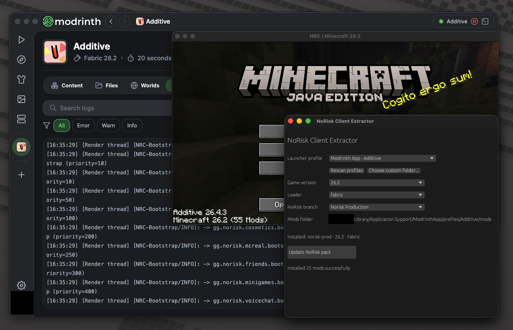

# nrctool (NoRiskClient Extraction Tool)

Have you ever wanted to use NoRisk Client but instead of the official launcher you wanted to keep your own favorite? Well now you can! This tool allows you to install and use the NoRisk client in any launcher of your choice. You don't even have to have the official launcher installed!



- Works with Minecraft Launcher, Prism Launcher, MultiMC, Modrinth App, CurseForge, and ATLauncher.
- You can install and update compatible NoRisk branches and switch between them
- All your existing mod files stay, but you might have to fix conflicts yourself
- Pulls the content straight from the official NoRisk servers.


- Download from github releases: [Latest version](https://github.com/lunalna/nrctool/releases/latest) 

## Build

```sh
cargo run
```

### Windows and Linux

Install Cargo tools and Zig:

```sh
cargo install --locked cargo-xwin cargo-zigbuild
rustup target add x86_64-pc-windows-msvc x86_64-unknown-linux-gnu
```

On macOS, install LLVM and Zig with Homebrew:

```sh
brew install llvm zig
```

On Linux or Windows, install LLVM/Clang and Zig with your normal package manager.

To build on Linux/OSX:

```sh
./scripts/build-cross.sh windows
./scripts/build-cross.sh linux
./scripts/build-cross.sh all
```

On windows:

```powershell
.\scripts\build-cross.ps1 windows
.\scripts\build-cross.ps1 linux
.\scripts\build-cross.ps1 all
```

Output: `dist/`.

### macOS

You probably need a mac for this to work (intel should be fine)

```sh
./scripts/build-macos-app.sh
./scripts/build-macos-app.sh --install
./scripts/build-macos-app.sh --notarize
```
